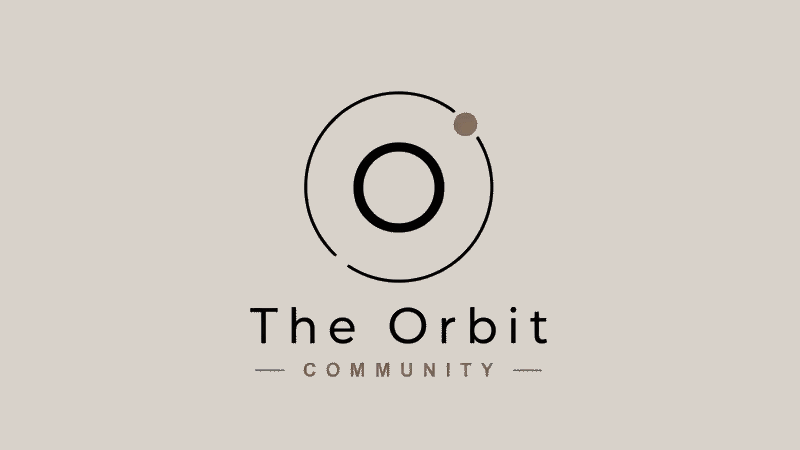

##  Who are we

  

**The Orbit Community** is one of the fastest-growing and most reliable WhatsApp tech communities, built with a simple mission:

> **Making opportunities more accessible for every tech enthusiast.**

Whether you're a student, aspiring developer, or working professional, The Orbit helps you stay updated with valuable opportunities in the tech ecosystem.

##  What We Share

We regularly post updates about:

- Free Tech Meetups
-  Workshops
-  Hackathons
-  Conferences
-  Internships
-  Job Opportunities
-  Learning Resources & More

## Our Community

We're proud to have **500+ active members**, including:

- Students
- Software Engineers
- Developers
- Tech Enthusiasts
- Working Professionals

Join a community where learning, networking, and opportunities come together.

##  Connect With Us

-  **LinkedIn:** https://www.linkedin.com/company/theorbitcommunity/
-  **WhatsApp Community:** https://chat.whatsapp.com/Bw3f8bBRBjV0hElgCJgA1o

---

 **Join The Orbit and never miss your next opportunity!**
